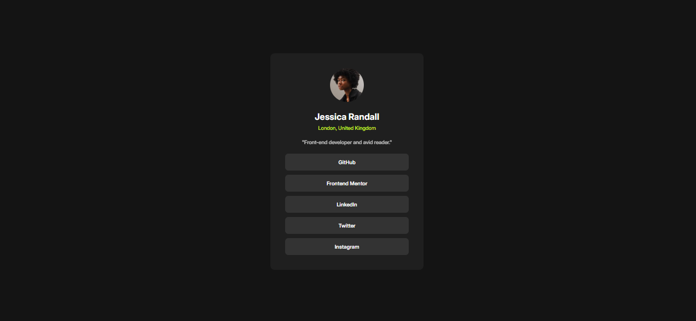
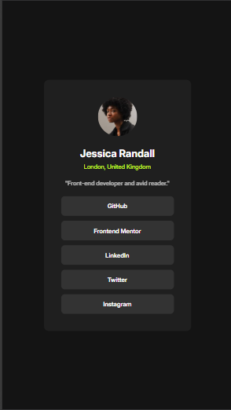
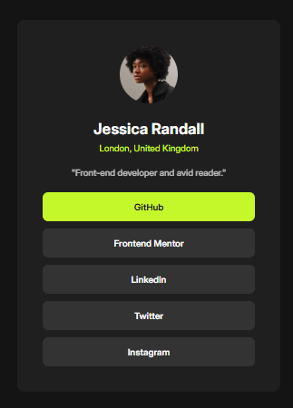

# Frontend Mentor - Social links profile solution

This is a solution to the [Social links profile challenge on Frontend Mentor](https://www.frontendmentor.io/challenges/social-links-profile-UG32l9m6dQ). Frontend Mentor challenges help you improve your coding skills by building realistic projects.

## Table of contents

- [Overview](#overview)
  - [The challenge](#the-challenge)
  - [Screenshot](#screenshot)
  - [Links](#links)
- [My process](#my-process)
  - [Built with](#built-with)
  - [What I learned](#what-i-learned)
  - [Useful resources](#useful-resources)
- [Author](#author)

## Overview

### The challenge

Users should be able to:

- See hover and focus states for all interactive elements on the page

### Screenshot

#### Full Screen

#### Mobile

#### Active State

### Links

- Site Solution: [Add live site URL here](https://vercel.com/cesar-cubarrubias-projects/random-profile-card)

## My process

### Built with

- BEM architecture 🏗️
- Semantic HTML5 📄
- CSS only 💯

### What I learned

1. I learned how to use the "clamp()" function for making the card responsive
2. Making a better use of variables. Not perfect but I tried 🤓
3. Make a better use of BEM for css classes.

### Useful resources

1. [w3school](https://www.w3schools.com) - Helped me with tutorials of how to use several CSS properties

## Author

- Frontend Mentor - [@yourusername](https://www.frontendmentor.io/profile/clch2409)
